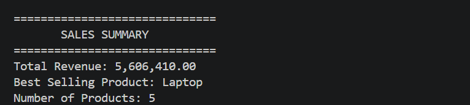
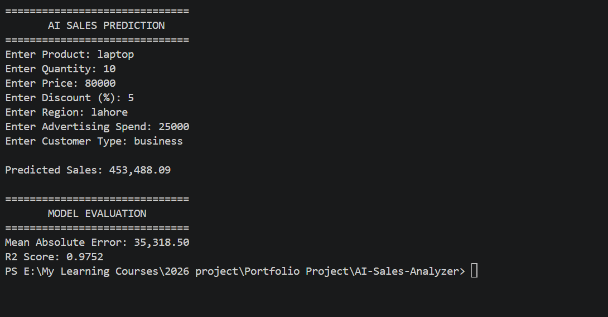
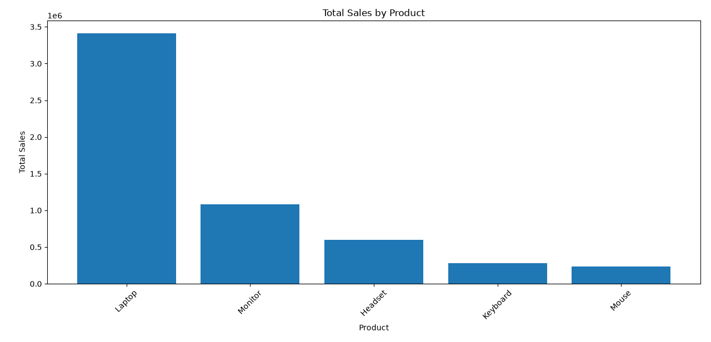

# AI Sales Analyzer

A Python-based sales analysis and machine learning project that analyzes sales data, visualizes product performance, and predicts expected sales using Linear Regression.

## Project Overview

AI Sales Analyzer is a portfolio project demonstrating how Python, data analysis, visualization, and machine learning can be combined to solve a simple business problem.

The project analyzes historical sales data and uses a machine learning model to estimate sales based on product, quantity, price, discount, region, advertising spend, and customer type.

## Features

* Load and analyze sales data from CSV
* Calculate total sales revenue
* Identify the best-performing product
* Generate product sales visualization
* Preprocess categorical and numerical features
* Train a Linear Regression model
* Predict expected sales for new inputs
* Evaluate model performance using MAE and R² Score

## Technologies

* Python
* Pandas
* NumPy
* Matplotlib
* Scikit-learn
* Linear Regression
* Git
* GitHub

## Machine Learning Workflow

```text
Sales Data
    ↓
Data Loading
    ↓
Data Analysis
    ↓
Feature Preparation
    ↓
Categorical Encoding
    ↓
Train/Test Split
    ↓
Linear Regression
    ↓
Sales Prediction
    ↓
Model Evaluation
```

## Machine Learning Features

The model uses the following features:

* Product
* Quantity
* Price
* Discount
* Region
* Advertising Spend
* Customer Type

Target variable:

* Total Sales

## Model Evaluation

Using the current practice dataset, the model produces approximately:

* Mean Absolute Error: `35,318.50`
* R² Score: `0.9752`

> Note: This is a small synthetic practice dataset created for learning and portfolio development. These metrics should not be interpreted as real-world business performance.
## Project Screenshots

### Sales Summary



### AI Sales Prediction



### Sales Graph



## Example Prediction

```text
Product: Laptop
Quantity: 10
Price: 80000
Discount: 5%
Region: Karachi
Advertising Spend: 30000
Customer Type: Business

Predicted Sales: 576,172.75
```

## Project Structure

```text
AI-Sales-Analyzer/
│
├── main.py
├── sales_data.csv
└── README.md
```

## How to Run

Install the required libraries:

```bash
python -m pip install pandas numpy matplotlib scikit-learn
```

Run the project:

```bash
python main.py
```

## Skills Demonstrated

This project demonstrates practical experience with:

* Python programming
* Data analysis
* Data visualization
* Feature preprocessing
* Machine learning
* Regression
* Model evaluation
* Git and GitHub
* Building a portfolio project

## Future Improvements

* Add more historical sales data
* Add date-based features
* Compare multiple machine learning models
* Add interactive dashboards
* Build a web interface using Streamlit
* Deploy the application online

## Author

**Saqlain Zahoor**

GitHub: `saqlainzahoor`
